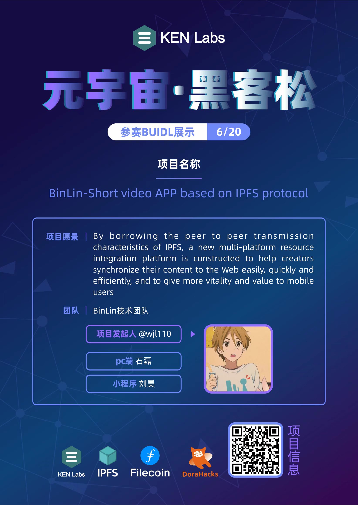

# Metaverse short video APP under the ipfs protocol based on web3.0--BinLin (accessible version)
[Chinese](README_chinese.md)、
[English](README.md)
---

---

## [Video introduction](https://www.bilibili.com/video/BV12A4y1R7mU/)、[PPT(English version)](https://docs.qq.com/document/DTmJRdlBpcmxJQXVD)、[PPT(Chinese Version)](https://docs.qq.com/document/DTkZ6enV3b3pIcFdk)、[Technical Description](README_file.md)

---
# Demo Code library
## [Applets](https://github.com/wjl110/BinLin/tree/master)、[Applets UI](https://github.com/wjl110/BinLin/tree/master/BinLinUI)、[Applets Back end](https://github.com/wjl110/BinLin/tree/master/BinLinBack)

## [PC](https://github.com/wjl110/BinLin/tree/ui/BinLin)

---

## Member introduction
Team: BinLin technical team

Project sponsor: [WangJianLin](https://github.com/wjl110/)

PC : [ShiLei](https://github.com/916202420)

Applets: [LiuHao](https://github.com/lhlh123456)

*The team members are all students from colleges and universities in mainland China*
---

# Project Featured 
## IPFS、NFT virtual AI、Digital Collection、NFC-based social business card exchange、Content synchronization

---
[ Project official website :wjl110.cn](https://wjl110.cn/)

Welcome To Web3.0 salute!
